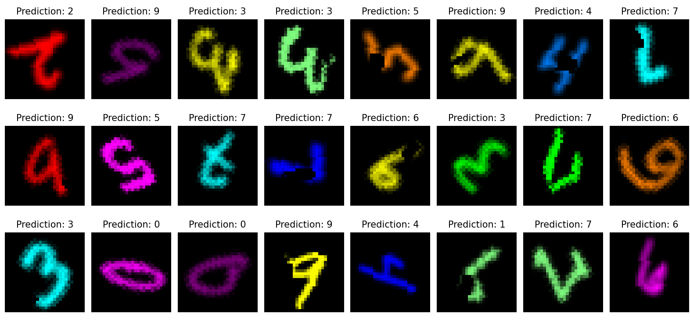

# Colored MNIST Challenge - Robust Image Classification

This repository contains my solution to the Colored MNIST Challenge, where the objective was to classify handwritten digits from noisy, colorized versions of the classic MNIST dataset. The challenge tested the robustness of machine learning models across varying levels of dataset difficulty: Easy, Medium, and Hard.

## Project Highlights

- **Objective**: Develop a model that classifies digits accurately, even under high noise and color distortions.
- **Datasets**: Provided in three difficulty levels, requiring adaptive preprocessing and modeling.

## Methodology

1. **Preprocessing**: Noisy, colorized images were preprocessed for optimal feature extraction.
2. **Model Design**: A custom Convolutional Neural Network (CNN) was designed using PyTorch.
3. **Evaluation**: Model performance was evaluated on each dataset, analyzing accuracy degradation with noise levels.

## Key Results

- Achieved **97.42% accuracy** on the Easy dataset.
- Achieved **91.7% accuracy** on the Medium dataset.
- Achieved **63.43% accuracy** on the Hard dataset.
- Demonstrated the effectiveness of noise-robust architectures for challenging image classification tasks.

## Project Structure

- **data/**: Scripts and links to download datasets.

The dataset for the hard level is a large file that doesn't exist in this repo: make sure to download it from this link: https://drive.google.com/file/d/1L_RYPVH94ntWnm6b8okzfMobZhNr1IEh/view?usp=sharing, and add it to the data/ folder

- **predictions/**: Contains the files with the models predictions of the labels of the testing datasets.
- **solutions/**: Contains the files with the correct labels of the testing datasets.
- **src/**: The code for calculating accuracy and showing examples of digit identification.

## How to Run

Clone the repository:
'''bash
git clone https://github.com/Mahdi-Ayadi/Formatted_MNIST_CNN.git

Install the dependencies:
'''bash 
pip install -r requirements.txt

Open the notebook in Jupyter or Colab and follow the instructions for dataset download and model training.

## Key Takeaways
This project illustrates how robust preprocessing and carefully designed architectures can significantly improve performance on noisy datasets. It provides a foundation for tackling similar challenges in real-world applications, where noise and variability are prevalent.

Feel free to explore, suggest improvements, or share feedback through issues or pull requests!

